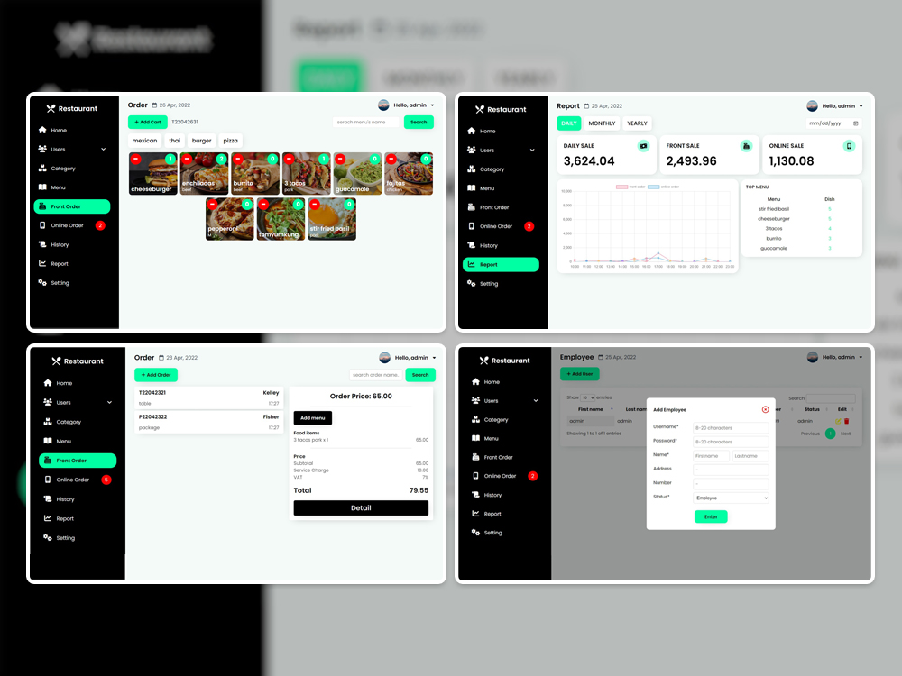

# Restaurant-Management

A Point of Sale (POS) web application for order management comes with a Bootstrap website to support online orders from customers.

## Description

This is the graduation project for my Diploma of Vocational Education. While building this project, I learned how to design Data Flow Diagram and ER Diagram for my project, design the UI using Figma, and work with Relational Databases efficiently using SQL statements. 

## Stack

- [Bootstrap 5](https://getbootstrap.com/) - Only using this to built the restaurant website
- [HTML5](https://www.w3schools.com/html/) - The standard markup language for Web pages.
- [SCSS](https://sass-lang.com/) - An extension to CSS which adds nested rules, variables, selector, etc.
- [PHP](https://www.php.net/) - A scripting language that uses for communicating with the Database.
- [MySql](https://www.mysql.com/) - A relational database management system based on SQL.
- [jQuery](https://jquery.com/) - Create animation with CSS and loading content without refreshing the page.
- [Chart.js](https://www.chartjs.org/) - Making a beautiful chart and animation to display the Sales report.
- [DataTable.js](https://datatables.net/) - A plug-in for jQuery that adds advanced features to HTML table.

## Project scope

### Management System
- **Admin**
  - Login / Logout
  - Update profile
  - Employee - add, edit, delete 
  - Customer - add, edit, delete 
  - Category - add, edit, delete 
  - Menu - add, edit, delete 
  - Front Order - add, edit, delete 
  - Online Order - edit, delete 
  - History - read, delete 
  - Report - see Daily, Monthly, and Yearly sales
  - Setting - edit
- **Employee**
  - Can do everything. Except:
  - Edit Employee information
  - Edit Setting
  - See sales report 
  
### Website
- **Customer**
  - Visit the website without login
  - Register
  - Login
  - Update profile
  - Add menu to cart
  - Confirm order
  - Cancle order
  - Upload payment
  - Recived order

## Design

### Management system

### Website

